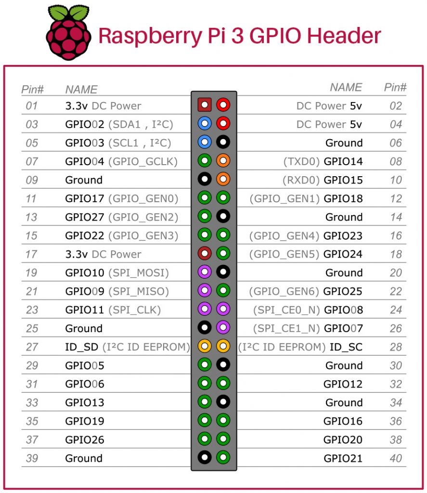
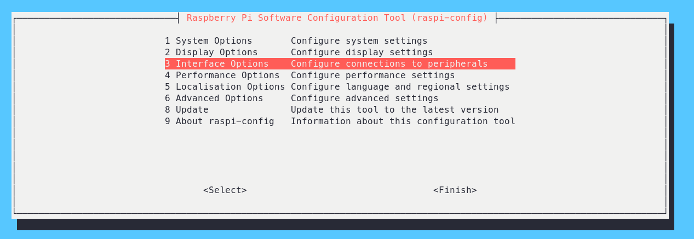
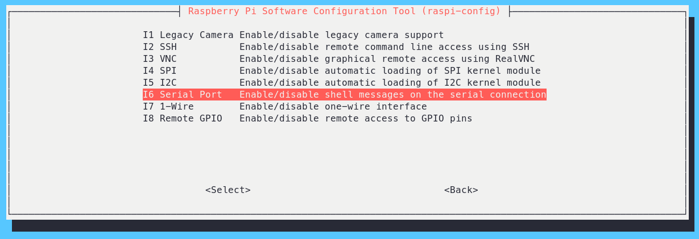
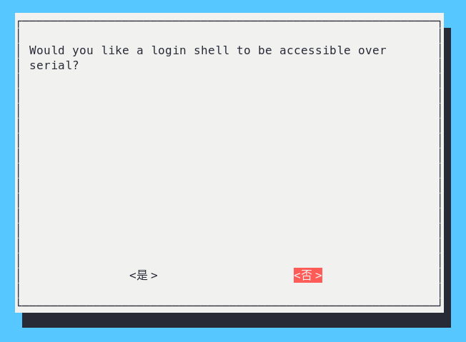
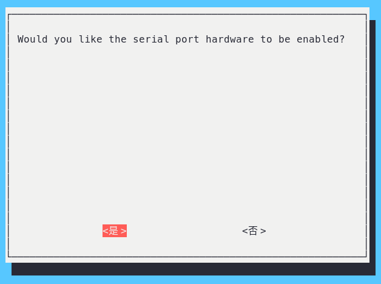
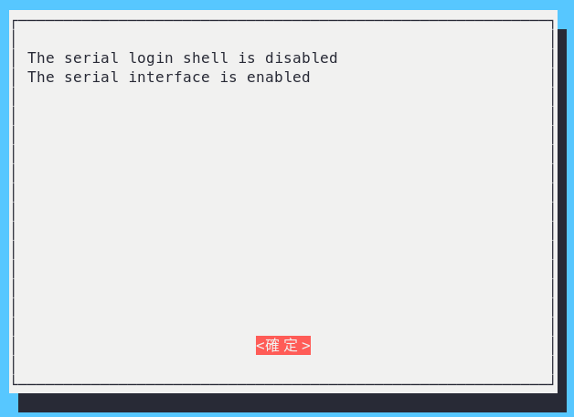

# raspi_g

This is a simple raspberry pi sensor gateway project. It reads SHT3x sensor by RS485 and publishs the data to PC or APP by MQTT. There are predefine five GPIOs (GPIO5, GPIO6, GPIO13, GPIO19 and GPIO26) to be output mode. You can use these GPIOs to control devices (Ex. LEDs, motors).

GPIO number|Description
---|---
26|DO1
19|DO2
13|DO3
6|DO4
5|DO5
14|UART TX
15|UART RX


## GPIO Pinout

[Pinout](https://pinout.xyz/)




## Install Python libraries

* [paho-mqtt](https://pypi.org/project/paho-mqtt/): MQTT client library
* [RPi.GPIO](https://sourceforge.net/p/raspberry-gpio-python/wiki/BasicUsage/): A module to control Raspberry Pi GPIO channels
* [minimalmodbus](https://minimalmodbus.readthedocs.io/en/stable/index.html): Easy-to-use Modbus RTU and Modbus ASCII implementation for Python
* pyserial: Python Serial Port Extension

```
# pip3 install -r requirements.txt
Looking in indexes: https://pypi.org/simple, https://www.piwheels.org/simple
Collecting minimalmodbus==2.1.1 (from -r requirements.txt (line 1))
  Using cached https://www.piwheels.org/simple/minimalmodbus/minimalmodbus-2.1.1-py3-none-any.whl (32 kB)
Collecting paho-mqtt==1.6.1 (from -r requirements.txt (line 2))
  Using cached https://www.piwheels.org/simple/paho-mqtt/paho_mqtt-1.6.1-py3-none-any.whl (75 kB)
Collecting pyserial==3.5 (from -r requirements.txt (line 3))
  Using cached https://www.piwheels.org/simple/pyserial/pyserial-3.5-py2.py3-none-any.whl (90 kB)
Collecting RPi.GPIO==0.7.1 (from -r requirements.txt (line 4))
  Using cached https://www.piwheels.org/simple/rpi-gpio/RPi.GPIO-0.7.1-cp39-cp39-linux_armv7l.whl (66 kB)
Installing collected packages: RPi.GPIO, pyserial, paho-mqtt, minimalmodbus
Successfully installed RPi.GPIO-0.7.1 minimalmodbus-2.1.1 paho-mqtt-1.6.1 pyserial-3.5
```


## Enable UART

1. Enter following command in Terminal
```shell
# sudo raspi-config
```
2. Select **Interfacing Options**

3. Then select **Serial**

4. The it will ask for login shell to be accessible over Serial, select **No**

5. Then it will as for enabling Hardward serial port, select **Yes**

6. Finally, out UART is eanbled for Serial Communication.

7. Reboot device


## Disable Bluetooth

Add `dtoverlay=pi3-disable-bt` to /boot/config.tx and reboot device.
